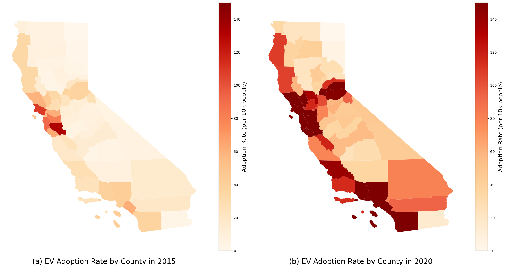
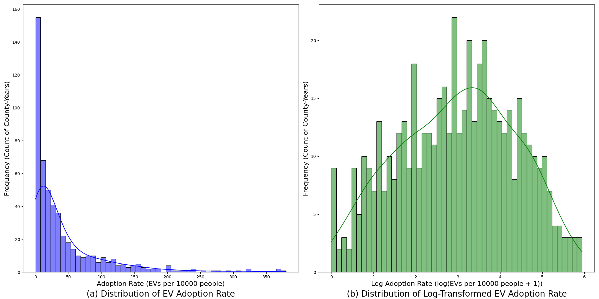
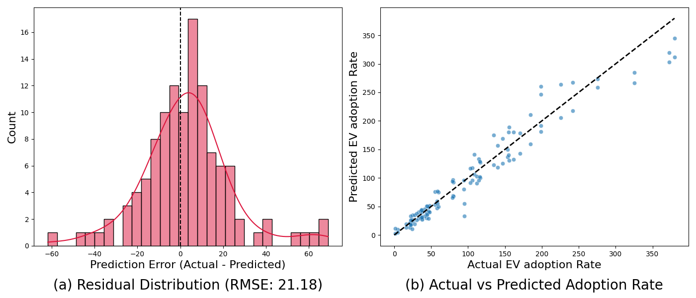
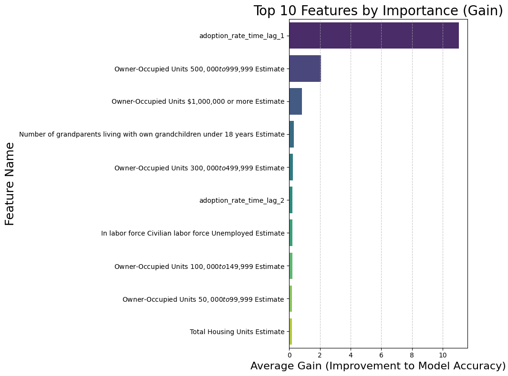
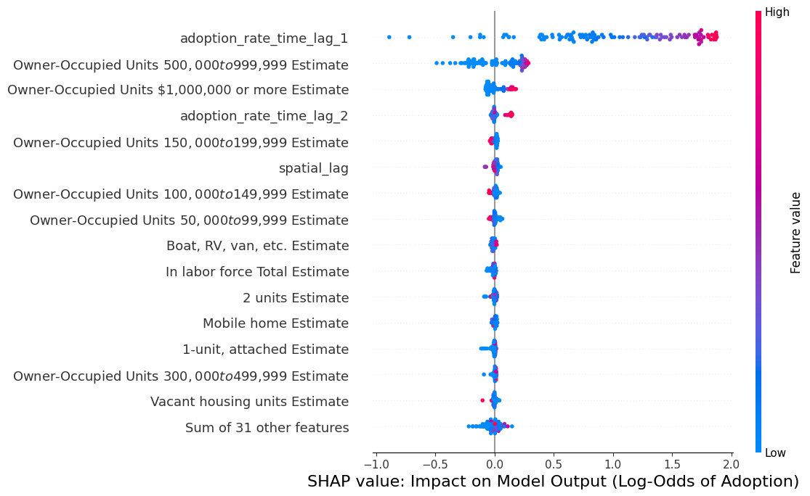

# Predicting Electric Vehicle Adoption Rates Using Spatiotemporal Features

## Abstract

The adoption rate of Electric Vehicles (EVs) is a critical metric for tracking progress in transportation
decarbonization.
Identifying the determinants of adoption and accurately forecasting future trends are essential for effective policy and
infrastructure planning.
This study develops a predictive model for county-level EV adoption rates in California using XGBoost.
By integrating historical EV registration records, socioeconomic indicators, and fuel price
data in California, the model identifies spatiotemporal patterns and key predictors of EV adoption.
Results demonstrate that regional historical EV adoption rate is the most dominant predictor of future growth,
indicating a strong temporal dependence. Neighboring counties average EV adoption rate also exhibits a positive
but subordinate influence, confirming the presence of spatial spillover effects. Among socioeconomic factors,
the number of high-value owner-occupied housing units emerges as the most significant factor.
These findings clarify the spatiotemporal dynamics of the EV market and provide a data-driven
foundation for targeted interventions to accelerate adoption.

## Data

This study synthesizes multiple data sources to construct a comprehensive dataset for modeling county-level EV adoption
rates in California.
The dataset integrates EV registration records, fuel price data from the U.S. Energy Information Administration (EIA),
and vehicle market dynamics (vehicle population and sales) from California energy agencies.

Socioeconomic indicators, such as median family income, educational attainment, and housing values distribution, were sourced from
the
American Community Survey (ACS). Due to data availability, 5-year estimates were used to represent
single-year data (e.g., 2016–2020 estimates represent the year 2020).

<figure style="text-align: center;">
    
    <figcaption style="text-align: center;">
        <b>Fig.1 Spatial-temporal Distribution of EV Adoption Rate in CA</b>
    </figcaption>
</figure>
 

The training set utilizes input features from 2012 to 2018, while data corresponding to the 2020 target year is employed as the test set.
The input features are as listed below:

**Table.1 Data Sources and Descriptions**

| Data Source                                                                                                | Description                                            |
|------------------------------------------------------------------------------------------------------------|--------------------------------------------------------|
| CA_EV_registration.csv                                                                                     | California EV registration data                        |
| [New_ZEV_Sales_Last_updated_10-13-2025_ada.xlsx](New_ZEV_Sales_Last_updated_10-13-2025_ada.xlsx)           | New EV sales data in California                        |
| [data/Vehicle_Population_Last_updated_04-30-2025_ada.xlsx](New_ZEV_Sales_Last_updated_10-13-2025_ada.xlsx) | Light-Duty Vehicle Population in California            |
| [data/PET_PRI_GND_DCUS_SCA_A.xls](data/PET_PRI_GND_DCUS_SCA_A.xls)                                         | Retail Gasoline and Diesel Prices                      |
| [data/socioeconomic/](data/socioeconomic/)                                                                 | Socioeconomic metrics such as income, population, etc. |
| CA_Counties.zip                                                                                            | County-level shapefiles for California                 |

**Data Limitations and Exclusions**  

Two notable exclusions were made due to data compatibility issues:

- Charging Infrastructure: The EV_Chargers dataset range from 2020 to 2022 and was thus excluded due to a temporal
  mismatch with other variables.
- Feature Consistency: While the ACS provides over 100 annual socioeconomic metrics, significant inconsistencies in column
  nomenclature across years made standardization difficult even using regular expressions. Consequently, some
  socioeconomic features with inconsistent columns across years were excluded from the current model. Future work will prioritize
  reconciling these naming discrepancies to incorporate the full range of socioeconomic features.

# Model

To normalize for population heterogeneity across counties, the model utilizes the EV adoption rate as the target
variable,
defined as the number of registered EVs per 10,000 people. As illustrated in Figure 2, the raw distribution of
county-year registrations exhibits a right skew distribution, characterized by a long tail of high-adoption outliers. To
mitigate the influence of these extreme values and stabilize variance, a log-transformation is applied. Specifically,
the final target variable is defined as:

$$
R_{i,t} = \log\left(1 + \frac{N_{i,t}}{Population_{i,t}/10000}\right) \tag{1}
$$

Where $R_{i,t}$ denotes the log-transformed EV adoption rate, $N_{i,t}$ denotes the number of registered EVs in
county $i$ in year $t$, and $Population_{i,t}$ denotes the corresponding population.

<figure style="text-align: center;">
    
    <figcaption style="text-align: center;">
        <b>Fig.2 EV Adoption Rate Distribution</b>
    </figcaption>
</figure>
 
This study employs an XGBoost framework to predict the log-transformed EV adoption rate.
To capture the spatiotemporal dynamics of EV adoption, the model constructs spatial and temporal lag features as part of
the input features. The temporal lag features are defined as the prior $k$ years adoption rates for each county, and
the spatial lag feature is defined as the average EV adoption rate of neighboring counties from the preceding year.

$$
S_{i,t} = \frac{\sum_{j \in N(i)} R_{j,t-1}}{|A(i)|} \tag{2}
$$

$$
T_{i,t}^k = \frac{N_{i,t-k}}{Population_{i,t-k}/10000} \tag{3}
$$

Where $S_{i,t}$ denotes the spatial lag feature for county $i$ at year $t$, $A(i)$ denotes the set of neighboring
counties (at least one point in common with others) of $i$. $T_{i,t}^k$ denotes the time lag feature with $k$ years lag.
The spatial-temporal features incorporated with other socioeconomic and EV-related features form the complete feature
set
for the XGBoost model. The complete feature set is summarized in the table below:

**Table.2 Feature Categories and Descriptions**

| Denote          | Feature Category       | Features Description                                                      |
|-----------------|------------------------|---------------------------------------------------------------------------|
| $SE_{i,t}^{k}$  | Socioeconomic Features | Median Family Income, Housing Value, Education attainment, etc.           |
| $EV_{i, t}^{k}$ | EV related Features    | Fuel Prices, Vehicle Populations, New vehicle sales                       |
| $S_{i,t}$       | Spatial Lag Features   | Average EV Adoption Rates of Neighboring Counties from the preceding year |
| $T_{i,t}^k$     | Time lag Features      | EV Adoption Rates in the prior k Years.                                   |

# Results

The model uses data from 2012 to 2018 as the training set, and data of 2020 as the test set. The
hyperparameters of XGBOOST are set as: $n-estimators=300, max-depth=6, learning-rate=0.05, subsample=0.8$.

The XGBoost model demonstrates strong predictive performance on the test set. Performance metrics were calculated on the
original scale (EV adoption per 10,000 people) to ensure interpretability. The model achieved a Root Mean Square Error (RMSE) of
21.18 As illustrated in Figure 3, the residual distribution approximates a normal
distribution centered near zero, suggesting minimal systematic bias in the model estimates. This fit is further
corroborated by the Actual vs. Predicted plot, where observations cluster closely along the diagonal. Notably, the model
exhibits low variance at lower actual values, indicating high precision in predicting adoption rates for counties with
low EV adoption.

<figure style="text-align: center;">
    
    <figcaption style="text-align: center;">
        <b>Fig.3 XGBOOST prediction residuals</b>
    </figcaption>
</figure>
 
Figure 4 illustrates the top ten features ranked by gains. The dominant feature is the historical EV adoption
rate (one-year lag), underscoring a strong temporal dependence in the adoption process. Five of the top ten features
in the model correspond to specific tiers of housing value (e.g., the count of units valued between $500,000 and $999,999).
These features serve as proxies for regional accumulated wealth.

<figure style="text-align: center;">
    
    <figcaption style="text-align: center;">
        <b>Fig.4 Feature importance</b>
    </figcaption>
</figure>
 
To interpret the directionality of these effects, SHAP (SHapley Additive exPlanations) value analysis is presented in
Figure 5. Red and blue points correspond to high and low feature values, respectively. The analysis reveals a strictly
positive relationship between historical and predicted adoption rates. While spatial lag features (adoption rates in
neighboring counties) contribute positively to predictions, their impact is subordinate to temporal lag features.
Additionally, higher housing unit values consistently drive higher predicted adoption rates, reinforcing the link
between asset wealth and EV adoption.

<figure style="text-align: center;">
    
    <figcaption style="text-align: center;">
        <b>Fig.5 SHAP value analysis</b>
    </figcaption>
</figure>
 

# Conclusion and Discussion

This study utilized an XGBoost framework to forecast county-level EV adoption rates in California, achieving robust
performance ($R^2=0.92$ and $RMSE=21.18$).
The analysis identifies the prior year's adoption rate as the primary determinant of
future growth, showing a much higher importance than spatial lag features,
indicating that temporal inertia significantly outweighs spatial spillover effects. The relatively lower
importance of spatial lags suggests that adoption is driven more by localized path dependence and infrastructure than by
diffusion from neighboring regions.

A distinct finding is the predictive superiority of accumulated housing assets over annual family income.
While income measures annual liquidity, regional property valuation serves as a proxy for accumulated wealth.
This divergence from traditional literature emphasizing income elasticity suggests that accumulated wealth may capture
the
adoption willingness of electric vehicles. Furthermore, regional property valuation likely proxies for critical transportation
infrastructure factors; higher-value properties are more likely to offer secure off-street parking and feasible home
charging facilities, making property value a more robust determinant of long-term EV adoption viability than income
alone.